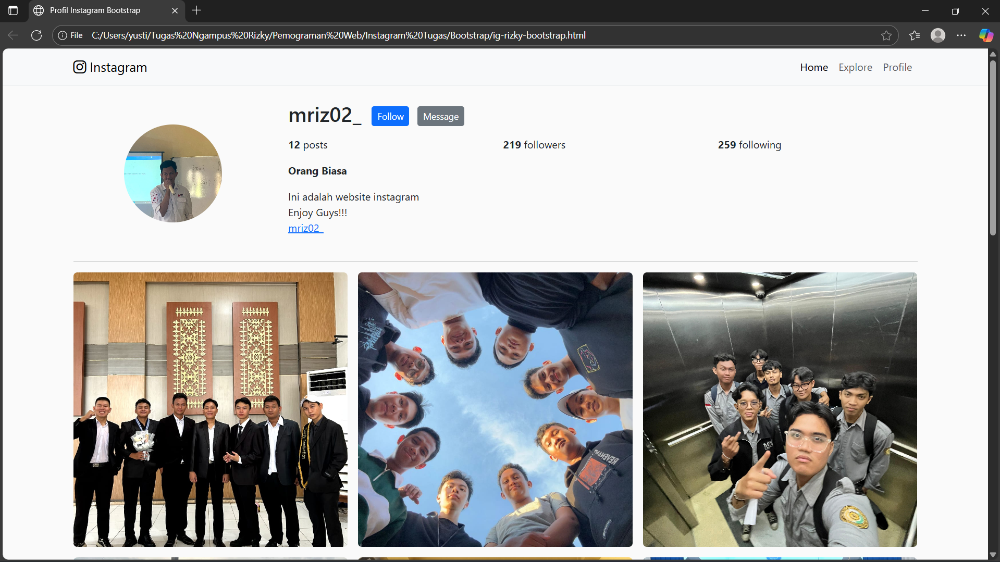

# Proyek Laman Profil Instagram Responsif dengan Tailwind CSS

Proyek ini adalah implementasi halaman profil Instagram yang sepenuhnya responsif, dibangun menggunakan HTML dan Tailwind CSS. Tujuan utama proyek ini adalah untuk mempraktikkan pendekatan *mobile-first*, memanfaatkan *utility classes* Tailwind untuk styling, dan mengimplementasikan layout yang adaptif untuk berbagai ukuran layar (mobile, tablet, dan desktop) tanpa menulis CSS kustom.




---

## 🚀 Teknologi yang Digunakan

- **HTML5**: Untuk struktur dasar halaman web.
- **Tailwind CSS (via CDN)**: Untuk styling dan layout responsif.

---

## ✍️ Penjelasan Desain & Jawaban Pertanyaan Reflektif

Bagian ini menjelaskan keputusan desain yang diambil selama pengembangan dan menjawab pertanyaan reflektif sesuai yang diminta.

### 1. Keputusan `grid-cols` dan `gap` di Tiap Breakpoint

Sistem grid untuk *feed* foto dirancang dengan pendekatan **mobile-first** untuk memastikan pengalaman pengguna yang optimal di semua perangkat.

- **Mobile (Default): `grid-cols-1`**
  Pada layar kecil, ruang horizontal sangat terbatas. Menampilkan satu kolom (`grid-cols-1`) adalah pilihan terbaik agar setiap gambar dapat dilihat dengan jelas dan besar.

- **Small Screens (Breakpoint `sm`): `sm:grid-cols-2`**
  Ketika layar sedikit lebih lebar (misalnya, pada mode landscape mobile), menampilkan dua kolom (`sm:grid-cols-2`) menjadi mungkin tanpa membuat gambar terlalu kecil.

- **Tablet (Breakpoint `md`): `md:grid-cols-3`**
  Layar tablet memiliki ruang yang cukup untuk menampilkan tiga kolom (`md:grid-cols-3`), yang meniru tampilan asli aplikasi Instagram dan memaksimalkan jumlah konten yang terlihat.

- **Penggunaan `gap` (`gap-1` dan `md:gap-4`)**
  `gap-1` digunakan pada ukuran mobile untuk memberikan sedikit pemisah antar gambar. Pada breakpoint `md` ke atas, `gap` ditingkatkan menjadi `md:gap-4` untuk memberikan ruang visual yang lebih nyaman seiring dengan bertambahnya ukuran layar.

### 2. Pemanfaatan Utility Responsif Tailwind untuk Memecahkan Masalah Layout

Utilitas responsif Tailwind (seperti `md:`, `sm:`) sangat krusial dalam mengatasi tantangan layout, terutama pada transisi dari mobile ke desktop. Berikut beberapa contoh implementasinya dalam proyek ini:

- **Mengubah Arah Layout:**
  Struktur utama bagian profil diatur secara vertikal pada mobile (`flex-col`) dan berubah menjadi horizontal pada layar yang lebih besar (`md:flex-row`). Ini memastikan konten utama seperti foto dan bio tetap terbaca di mobile, sementara di desktop, ruang dimanfaatkan secara efisien.
  ```html
  <header class="flex flex-col md:flex-row ...">
  ```

- **Menampilkan/Menyembunyikan Elemen:**
  Tombol "Follow" dan "Message" ditampilkan secara berbeda. Di desktop, tombol berada di samping nama pengguna (`hidden md:flex`). Di mobile, tombol-tombol ini dipindahkan ke bawah bio dengan lebar penuh agar mudah dijangkau (`flex md:hidden`).
  ```html
  <div class="hidden md:flex gap-2">...</div>
  <div class="flex md:hidden gap-2 w-full mt-4">...</div>
  ```

- **Adaptasi Ukuran:**
  Ukuran foto profil diubah agar proporsional dengan ukuran layar, yaitu lebih kecil di mobile dan sedikit lebih besar di desktop (`w-36 h-36 md:w-40 md:h-40`).

### 3. Trade-off: Banyak Utility Classes vs. Komponen CSS

Pendekatan Tailwind yang menggunakan banyak *utility class* di HTML memiliki trade-off yang jelas dibandingkan dengan pendekatan tradisional yang membuat komponen CSS sendiri (misalnya, `.btn-primary`).

- **Menggunakan Banyak Utility Classes (Pendekatan Proyek Ini)**
  - **Kelebihan**:
    - **Kecepatan Development**: Sangat cepat untuk membuat prototipe dan menerapkan gaya tanpa harus meninggalkan file HTML atau memikirkan nama kelas.
    - **Spesifik**: Gaya yang diterapkan sangat eksplisit dan tidak terpengaruh oleh CSS lain.
    - **Ukuran File Optimal**: File CSS akhir hanya berisi utilitas yang benar-benar digunakan.
  - **Kekurangan**:
    - **HTML "Kotor"**: File HTML bisa menjadi sangat panjang dan sulit dibaca, terutama untuk elemen yang kompleks.
    - **Tidak DRY (Don't Repeat Yourself)**: Jika ada elemen yang sama (misalnya tombol) di banyak tempat, kita harus mengulang rangkaian kelas yang sama berulang kali.

- **Membuat Komponen CSS (misalnya dengan `@apply`)**
  - **Kelebihan**:
    - **HTML Bersih**: HTML menjadi lebih semantik dan rapi (misal: `<button class="btn-primary">`).
    - **Reusable & Konsisten**: Mudah untuk menjaga konsistensi di seluruh aplikasi. Mengubah satu komponen akan mengubah semuanya.
  - **Kekurangan**:
    - **Memperlambat Awal Development**: Membutuhkan waktu untuk mendefinisikan komponen di file CSS terpisah.
    - **Abstraksi**: Terkadang kita membuat komponen yang terlalu umum, sehingga akhirnya tetap perlu menambahkan *utility class* untuk variasi kecil.

**Kesimpulan:** Untuk proyek skala kecil atau saat membuat prototipe, pendekatan **utility-first** sangat efisien. Namun, untuk proyek skala besar, pendekatan **hybrid** seringkali menjadi yang terbaik: gunakan *utility classes* untuk layout umum dan elemen unik, lalu ekstrak pola yang berulang menjadi komponen (misalnya menggunakan `@apply`) untuk menjaga kode tetap bersih dan mudah dikelola.
